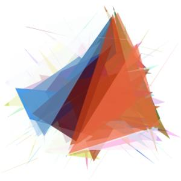
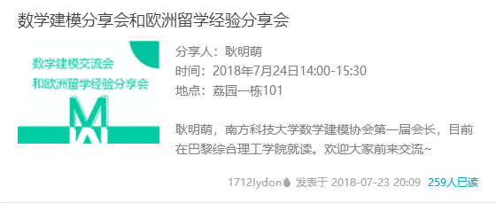
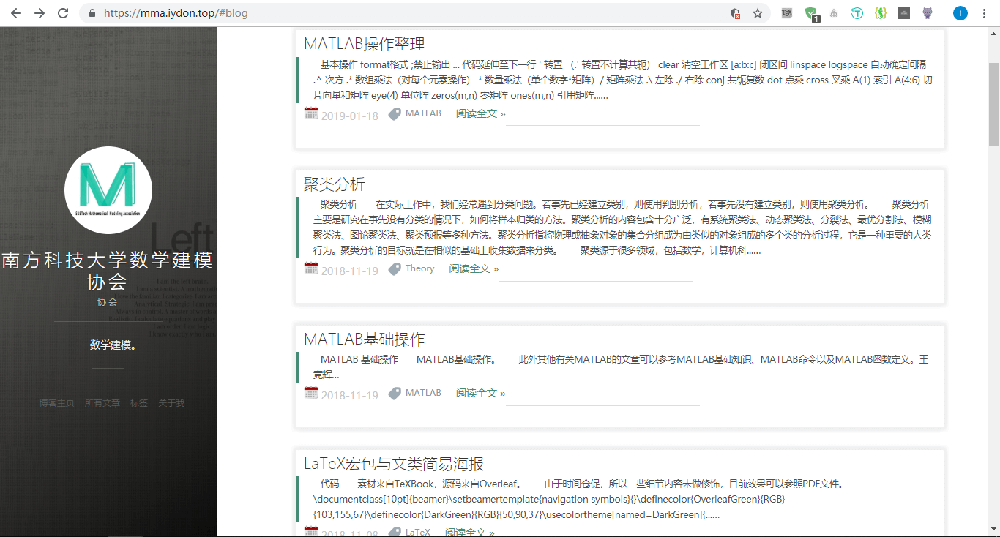
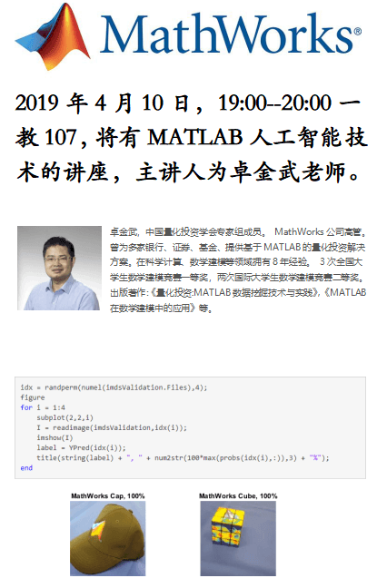

# 南方科技大学数学建模协会的历史时刻

## 2015年
### 2015年6月25日：创立数学建模协会QQ群

### 2015年8月22日：“深圳杯”数学建模夏令营在我校开营
[“深圳杯”数学建模夏令营在我校开营 彭实戈院士作主题报告](http://math.sustech.edu.cn/news/10036.html)

### 2015年8月25日：“深圳杯”数学建模夏令营圆满闭幕
[2015年“深圳杯”数学建模夏令营圆满闭幕 4支参赛队荣获一等奖](http://math.sustech.edu.cn/news/10037.html)

### 2015年11月12日：数学建模与科学计算讲座

### 2015年11月23日：全国大学生数学建模竞赛中再创佳绩
[我校本科生在全国大学生数学建模竞赛中再创佳绩](http://math.sustech.edu.cn/news/10044.html)

## 2016年
### 2016年4月15日：美国大学生数学建模竞赛再创佳绩
[我校学生在美国大学生数学建模竞赛再创佳绩](http://math.sustech.edu.cn/news/10062.html)

### 2016年4月20日：华东华中赛讲座

### 2016年5月7日：金融建模讲座

### 2016年8月19日：“深圳杯”数学建模挑战赛在我校开幕
[2016“深圳杯”数学建模挑战赛在我校开幕](http://math.sustech.edu.cn/news/10075.html)

### 2016年8月24日：“深圳杯”数学建模挑战赛闭幕
[2016年“深圳杯”数学建模挑战赛闭幕 南科大代表队荣获一等奖](http://math.sustech.edu.cn/news/10079.html)

### 2016年9月4日：国赛经验分享讲座

### 2016年9月7日：国赛重要事项及赛题分析讲座

### 2016年10月13日：TeX培训讲座

### 2016年11月16日：全国大学生数学建模竞赛再创佳绩
[南科大学子在全国大学生数学建模竞赛和全国大学生数学竞赛再创佳绩](http://math.sustech.edu.cn/news/10173.html)

### 2016年11月16日：数据挖掘及量化投资讲座

### 2016年11月25日：数学建模协会入会仪式及公众号成立

### 2016年11月28日：科隆杯数学建模竞赛讲座

### 2016年12月2日：国赛回顾分析讲座

### 2016年12月12日：国赛回顾分析讲座

## 2017年
### 2017年1月13日：美赛比赛注意事项及线性规划讲座

### 2017年3月10日：MATLAB视屏教学讲座

### 2017年3月15日：学期中第一次活动——数学建模的经历体会讲座

### 2017年3月18日：学期中周末活动——网络爬虫视屏教学讲座

### 2017年3月22日：学期中第二次活动——交通流模型讲座

### 2017年3月29日：学期中第三次活动——传染病模型讲座

### 2017年4月3日：泰迪杯思路分析讲座

### 2017年4月5日：学期中第四次活动——人口模型讲座

### 2017年4月12日：学期中第五次活动——MATLAB教学讲座

### 2017年4月14日：数学建模短期课程——论文写作中需要注意的问题

### 2017年4月17日：我校学子在美国大学生数学建模竞赛再创佳绩
[我校学子在美国大学生数学建模竞赛再创佳绩](http://math.sustech.edu.cn/news/10392.html)

### 2017年4月19日：学期中第六次活动——LaTeX教学讲座

### 2017年4月27日：学期中第七次活动——国赛赛题分析讲座

### 2017年5月3日：学期中第八次活动——数学建模常用算法讲座

### 2017年5月10日：学期中第九次活动——数学建模常用算法讲座

### 2017年6月23日：暑期活动介绍与安排讲座

### 2017年6月26日：暑期第一次活动——组队与重要事项讲座

### 2017年6月28日：暑期第二次活动——国赛美赛的赛题分享讲座

### 2017年6月29日：暑期讨论班——MATLAB交流讨论班

### 2017年7月2日：暑期第三次活动——线性规划类问题讲座

### 2017年7月5日：暑期第四次活动——优化算法讲座

### 2017年7月7日：暑期第五次活动——层次分析法讲座

### 2017年7月10日：暑期第六次活动——数据处理与分析讲座

### 2017年7月12日：暑期第七次活动——国赛注意事项分析讲座

### 2017年8月9日：数学建模短期课程——论文写作中需要注意的问题

### 2017年8月16日：“深圳杯”数学建模挑战赛开幕
[2017“深圳杯”数学建模挑战赛开幕](http://math.sustech.edu.cn/news/10627.html)

### 2017年8月24日：数学建模短期课程——论文写作中需要注意的问题

### 2017年11月3日：数学建模短期课程——历年国赛论文分析讲座

### 2017年11月18日：数学建模协会宣讲会

### 2017年11月20日：MATLAB数据建模与应用讲座

### 2017年11月22日：学期中第一次活动——MATLAB视频教学讲座

### 2017年12月1日：学期中第二次活动——MATLAB视频教学讲座

### 2017年12月3日：数学建模协会宣讲会
[我校数学建模协会举行换届大会暨2017学年第一次宣讲会](http://math.sustech.edu.cn/news/10769.html)

### 2017年12月4日：LaTeX参考文献教学讲座

### 2017年12月9日：学期中第三次活动——MATLAB视频教学讲座

### 2017年12月12日：学期中第四次活动——数学建模基本框架及比赛技巧讲座

### 2017年12月14日：学期中第五次活动——MATLAB视频教学讲座

### 2017年12月18日：学期中第六次活动——国赛赛题分析讲座

### 2017年12月22日：学期中第七次活动——MATLAB视频教学讲座

### 2017年12月29日：学期中第八次活动——MATLAB视频教学讲座

## 2018年
### 2018年1月15日：数学建模短期课程——历年国赛论文分析讲座

### 2018年1月22日：数学建模短期课程——历年国赛论文分析讲座

### 2018年1月30日：寒假讨论班——美赛建模知识讨论班

### 2018年3月11日：南科大数学建模公众号——MATLAB连载

### 2018年3月15日：赛前集训——架构性分析讲座

### 2018年3月24日：学期中第一次活动——机理建模在数学建模中的应用讲座

### 2018年4月13日：学期中第三次活动——排队论理论讲座

### 2018年4月22日：学期中第二次活动——聚类理论讲座

### 2018年5月3日：学期中第四次活动——MATLAB入门讲座

### 2018年5月17日：学期中第五次活动——图论算法讲座

### 2018年5月31日：数学建模协会会长风采录
[2018届毕业生李杨：始终在路上的“实干家”](http://math.sustech.edu.cn/news/11120.html)

### 2018年6月3日：Simulink建模与实例讲座

### 2018年6月6日：我校学子在美国大学生数学建模竞赛斩获多个奖项
[我校学子在2018美国大学生数学建模竞赛斩获多个奖项](http://math.sustech.edu.cn/news/11121.html)

### 2018年7月6日：暑期第一次活动——辅助工具及心得讲座

### 2018年7月11日：暑期第二次活动——国赛的解析与方法讲座

### 2018年7月12日：暑期第五次活动——国赛的解析与方法讲座

### 2018年7月13日：暑期第三次活动——LaTeX入门讲座

### 2018年7月16日：暑期第四次活动——答疑环节

### 2018年7月19日：暑期第五次活动——国赛的解析与方法讲座

### 2018年7月23日：数学建模分享会与欧洲留学经验分享会

### 2018年7月26日：暑期第六次活动——马云云微分方程讲座
[培训笔记分享](https://github.com/SUSTech-MMA/Modeling_Notes)

### 2018年8月2日：暑期第七次活动——马云云差分方程讲座
[培训笔记分享](https://github.com/SUSTech-MMA/Modeling_Notes)

### 2018年8月7日：暑期第八次活动——马云云概率统计讲座
[培训笔记分享](https://github.com/SUSTech-MMA/Modeling_Notes)

### 2018年8月17日：暑期第九次活动——马云云规划模型讲座
[培训笔记分享](https://github.com/SUSTech-MMA/Modeling_Notes)

### 2018年8月22日：暑期第十次活动——马云云图论与网络优化讲座
[培训笔记分享](https://github.com/SUSTech-MMA/Modeling_Notes)

### 2018年10月1日：数学建模协会宣讲会
[数学建模协会宣讲会](https://mma.iydon.top/2018/10/seminar_introduction-Lecture/)

### 2018年10月18日：学期中第一次活动——MATLAB与LaTeX教学讲座

### 2018年10月23日：数学建模协会博客创立
[南方科技大学数学建模协会博客](https://mma.iydon.top/)

### 2018年10月25日：学期中第二次活动——论文写作教学讲座

### 2018年11月17日：学期中第三次活动——聚类教学讲座

### 2018年12月1日：学期中第四次活动——美赛赛题与论文写作讲座

## 2019年
### 2019年1月14日：学期中第五次活动——美赛报名指南讲座

### 2019年1月15日：学期中第六次活动——美赛赛前准备讲座

### 2019年1月23日：数学建模竞赛为建模队伍提供教室支持

### 2019年2月18日：数学建模课程
由数学建模协会指导老师李景治教授开展数学建模课程，系统地传授数学建模知识。

### 2019年4月10日：MATLAB人工智能技术讲座

